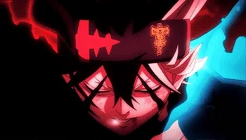
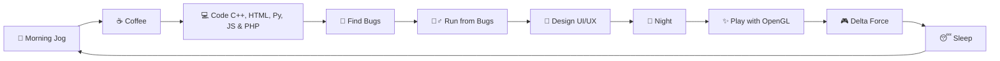

<div align="center">

  <!-- Animated Header -->
             

  <!-- Banner -->
  

  

  <!-- Divider Wave -->
  <!-- Animated Header (Asta) -->
  

</div>

<!-- About Me Section -->
## 🧑‍💻 About Me

> Just a developer who enjoys crafting **aesthetically pleasing UI/UX designs**, as well as tweaking the logic behind the scenes. During the day, I'm busy 'struggling' with **JS and PHP**, and at night, I play around with **OpenGL**.

```yaml
name: Baruna Andrean
location: Indonesia
role: Web Developer & UI/UX Enthusiast
morning_struggle: ["JavaScript", "PHP", "Debugging"]
night_adventure: ["OpenGL", "Graphics Programming", "Shaders"]
database_love: "MySQL enthusiast ☕"
fuel: "Caffeine and the mystery of why my code worked on the first try"
life_goal: "Create clean code and interfaces that don't confuse users"
morning_routine: "Trying to consistently jog... mostly from bugs 🏃‍♂️"
game: "Delta Force 🎮"
```

<!-- Tech Stack Section -->
## 🛠️ My Daily Weapons


### 💻 Web Trio (The ones that keep me busy)
<p align="left">
  
  
  
  
  
</p>

### 🗄️ Data
<p align="left">
  
  
</p>

### 🎨 Graphics & Design
<p align="left">
  
  
  
</p>

### ⚙️ Tools I Use
<p align="left">
  
  
  
  
</p>

<!-- My Routine -->
## 🌅 My Daily Routine



<!-- GitHub Stats Section -->

<!-- Now Playing / Gaming Section -->
## 🎮 When I'm Not Coding...

<div align="center">

  <!-- Delta Force Badge -->
  
  <br><br>
  
  

</div>

<!-- Connect With Me Section -->
## 🤝 Connect With Me

<div align="center">

  <a href="https://linkedin.com/in/barunaandrean" target="_blank">
    
  </a>
  <a href="https://instagram.com/_andre429" target="_blank">
    
  </a>
  <a href="https://tiktok.com/@_andre135" target="_blank">
    
  </a>
  <a href="mailto:barunaandrean@email.com" target="_blank">
    
  </a>
  <a href="https://github.com/BarunaAndrean" target="_blank">
    
  </a>

</div>


